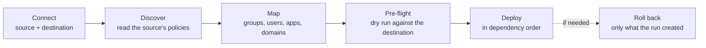

<div align="center">

# Movewise

**Move Microsoft 365 policies from one tenant to another, with a dry run before anything changes.**


[Download](#download) · [Build from source](#build-from-source) · [How it works](#how-it-works) · [What it migrates](#what-it-migrates) · [Docs](#documentation)

</div>

---

Movewise is a Windows app for tenant-to-tenant migrations. An admin signs in to the **source** tenant (read only) and the **destination** tenant, picks the policies to move, maps everything they depend on, checks the result in a dry run, and deploys. Every run can be resumed, and rolled back to take out only what it created.

## How it works



| Step | What happens |
|---|---|
| **Connect** | Sign in to each tenant through the Windows sign-in broker. Guest accounts and same-tenant pairs are refused, and each side's admin roles and licenses are checked |
| **Discover** | Policies are read from the source with everything they point at: groups, users, apps, locations, filters, scope tags, domains, mailboxes and sites |
| **Map** | Each dependency is matched in the destination automatically where possible (by name, email, app ID or domain), or matched, created or removed by hand. Mappings export to and import from CSV |
| **Pre-flight** | Every policy is rewritten for the destination and checked: unmatched objects, name conflicts, missing licenses and roles, removed exclusions, and a before/after view per policy |
| **Deploy** | Groups and policies are created in order, with progress saved after every object. A run survives a crash, a stop or a dropped connection |

### Safe by design

- **The source is never changed.** The source's Graph client can only read, and its PowerShell sessions refuse anything but `Get-` cmdlets. See [why the source stays unchanged](docs/app-registration.md#why-the-source-stays-unchanged).
- **Policies land switched off or in test mode.** Conditional Access policies are created in report-only mode, mail flow rules in test mode, DLP in simulation mode, and retention and journal rules switched off. Retention policies never get Preservation Lock.
- **Rollback only undoes the run.** It deletes only the objects the run created, and puts back the earlier values of any settings it changed. Objects that were in the destination before are never deleted.
- **Try it with no tenant at all.** **Try the demo** connects two built-in sample tenants that live only in memory.

## Download

> **Pre-release.** 0.1.0 is an unsigned test build. Try it against test tenants, and don't hand it to client admins until it's signed (see [what's left](#before-the-first-release)).

1. Open the **[latest release](https://github.com/sameerk27/movewise/releases)**. Pre-releases are listed there too.
2. Download the file for your case:

   | File | Use it for |
   |---|---|
   | `Movewise-win-Setup.exe` | **Most people.** Installs for the current Windows user, with no admin rights needed, adds a Start menu shortcut, and installs WebView2 where it's missing |
   | `Movewise-win-Portable.zip` | Locked-down PCs where installers aren't allowed. Unzip it and run `Movewise.exe` |
   | `*.nupkg`, `RELEASES`, `releases.win.json`, `assets.win.json` | Update packages. Only needed on the server that installed copies update from; don't download these to run the app |

3. Run the installer. Until the build is signed, Windows SmartScreen shows **"Windows protected your PC"** with *Unknown publisher*. For a test build you trust, choose **More info**, then **Run anyway**, or clear the download flag first:

   ```powershell
   Unblock-File "$env:USERPROFILE\Downloads\Movewise-win-Setup.exe"
   ```

4. Start Movewise and **sign in to the destination first**: that sets up Movewise's app registration there. Then sign in to the source, which approves Movewise once. To use a registration you made yourself, and for the full list of permissions it's granted, see [docs/app-registration.md](docs/app-registration.md).

**Requirements:** 64-bit Windows 10 or 11, and admin accounts in both tenants. Nothing else is needed: .NET and the Exchange Online and Teams PowerShell modules are included.

**Updates:** once a download location is set in `UpdateUrl`, Movewise checks for a newer version when it starts. An **Update to x.y.z** button then appears in the sidebar. It only installs when you click it, and never during a deployment.

**Where your data lives:** everything is kept under `%LOCALAPPDATA%\MovewiseData`, outside the install folder, so updates and reinstalls leave it alone.

| Folder | Holds |
|---|---|
| `Projects` | Saved exports. They hold full policy settings, so they're kept out of Documents, which is often synced to OneDrive |
| `Runs` | One folder per deployment. `run.json` is what resume and rollback work from, and `destination-before` holds the destination's policies as they were before the run |
| `Logs` | Daily support logs, with tokens, secrets, addresses, tenant domains, usernames and IPs removed. **Save support log** in the sidebar zips the last two weeks |

## Build from source

### Prerequisites

| Tool | Version | Why |
|---|---|---|
| Windows | 10 or 11 | WPF and WebView2 (built into Windows 11) |
| [.NET SDK](https://dotnet.microsoft.com/download/dotnet/8.0) | 8 | Build and test |
| PowerShell | 5.1 or 7 | The module and release scripts in `tools/` |
| Git | any | Clone the repository |

### Run it locally

```powershell
git clone https://github.com/sameerk27/movewise.git
cd movewise

# Bundle ExchangeOnlineManagement and MicrosoftTeams, needed for Defender, Exchange, Purview and Teams policies
.\tools\Save-Modules.ps1

dotnet build
dotnet test
dotnet run --project src/Movewise.App
```

The engine and its tests (`Movewise.Core`) also build and run on Linux. Only the app itself needs Windows.

### Make a release

<table>
<tr>
<th width="50%">On GitHub (recommended)</th>
<th width="50%">On your own PC</th>
</tr>
<tr>
<td valign="top">

1. Go to **Actions → Release → Run workflow**.
2. Enter the version, such as `0.2.0`.
3. The workflow tests, bundles the modules, builds on Windows and packs with Velopack. It attaches everything to a **draft** release `v<version>`.
4. Check the draft, then press **Publish release**.

</td>
<td valign="top">

```powershell
.\tools\Publish.ps1 -Version 0.2.0 `
  -SignParams '/fd sha256 /tr <timestamp-url> /td sha256 /sha1 <thumbprint>'
```

The output goes to `artifacts\releases`. Without `-SignParams` (or `-AzureTrustedSignFile`), the build is unsigned.

</td>
</tr>
</table>

The version must go up with every release, or installed copies won't see it. The full process, signing and hosting updates are in [docs/releasing.md](docs/releasing.md).

## What it migrates

| Service | Policies and settings |
|---|---|
| **Entra ID** | Conditional Access, named locations, custom authentication strengths, user settings, the authentication methods policy, cross-tenant access, custom admin roles |
| **Intune** | Settings catalog, device configuration, compliance (with noncompliance actions), iOS and Android app protection, Autopilot profiles, assignment filters, scope tags, each with its assignments |
| **Defender for Office 365** | Anti-phishing, anti-spam, outbound spam, anti-malware, Safe Links, Safe Attachments, quarantine policies, Tenant Allow/Block List, preset security policies |
| **Defender for Endpoint** | Indicators and custom detection rules |
| **Exchange Online** | Mail flow rules, journal rules, remote domains, Outlook on the web policies, mailbox retention tags and policies, mobile device mailbox policies |
| **Purview** | DLP and retention policies with their rules, sensitivity labels and label policies, Endpoint DLP settings |
| **Teams** | Meeting, messaging, calling, app setup, app permission, channels and update policies with group assignments, plus org-wide settings |
| **SharePoint and OneDrive** | Sharing, sync and site creation settings |

Settings every tenant already has, such as default policies and org-wide settings, are changed to match the source rather than created. Only settings that differ are changed, and rolling back puts the earlier values back.

<details>
<summary><b>Full feature checklist</b></summary>

<br>

Phases 0 to 5 of the build plan:

- [x] Windows app shell (WPF + Blazor Hybrid) with the mockup's layout
- [x] Sign-in to source and destination through the Windows sign-in broker, one account per tenant; when Movewise has to ask again (new permissions, an expired session), a different account is refused
- [x] Guest accounts rejected; source and destination must be different tenants
- [x] Admin role check for each side, and licenses in the source that the destination lacks
- [x] Exchange Online connection test through PowerShell 7 hosted inside the app
- [x] Discover Entra ID: Conditional Access policies, named locations, custom authentication strengths
- [x] Discover Intune: settings catalog, device configuration, compliance (with noncompliance actions), iOS and Android app protection, Autopilot profiles, assignment filters, custom scope tags, each with its assignments
- [x] Dependencies found for every policy (groups, users, apps, locations, strengths, filters, scope tags); a type that can't be read shows a warning instead of stopping discovery
- [x] Save the selected policies to a project folder as normalized JSON
- [x] Map dependencies: groups (by name, then mail nickname), users (by email, then username), apps (by app ID), named locations, authentication strengths, filters and scope tags (by name, or created with the policies); manual matching with destination search, create or remove; decisions kept when matching again; CSV export and import
- [x] Pre-flight dry run: every policy rewritten for the destination (mapped IDs, placeholders for objects created during deploy, removals, report-only Conditional Access), with checks for unmatched objects, manual matches that no longer exist, admin roles, Entra ID P1/P2 and Intune licenses, name conflicts (skip or rename), removed exclusions, policies that exclude nobody, and secrets Graph doesn't return; before/after view per policy; CSV report
- [x] Deploy: pre-flight runs once more, optional copy of the destination's current policies, then groups (created empty) and policies in dependency order with IDs filled in as objects are created, then Intune assignments and app protection apps; progress saved after every object; resume after a stop, crash or dropped connection (an unanswered create is looked up by name before retrying, and for groups only one made after the request counts, so a same-name group already in the destination is never taken); a policy skipped because something it needs failed is tried again on resume; rollback that deletes only what the run created; Windows kept awake; results CSV
- [x] Defender for Office 365: anti-phishing, anti-spam, outbound spam, anti-malware, Safe Links and Safe Attachments policies, each with its rule; preset and default policies left out
- [x] Defender for Office 365: quarantine policies (created before the policies that name them; built-in ones left out) and the Tenant Allow/Block List (senders, URLs, file hashes; expired entries left out)
- [x] Settings every tenant already has are changed to match the source instead of created: the default anti-phishing, anti-spam, outbound spam and anti-malware policies; the tenant-wide Safe Links and Safe Attachments settings; quarantine notification settings; the Standard and Strict preset security policies (on or off, and who they apply to); the Default remote domain; the default Outlook on the web and mobile device mailbox policies. Pre-flight compares them with the destination's and shows before and after for each setting that differs; only those are changed; rolling back puts the destination's earlier values back
- [x] More settings, through Microsoft Graph and PowerShell: Entra ID user settings (Privileged Role Administrator) and the authentication methods policy with each sign-in method (Authentication Policy Administrator; pre-flight warns when a method would be switched off or narrowed); SharePoint and OneDrive sharing, sync and site creation settings (SharePoint Administrator); Endpoint DLP's tenant-wide settings (only those, not the other Purview switches in the same object); Teams org-wide (Global) meeting, messaging, calling, app setup and channels policies, external access, guest access and cloud storage, meeting settings, and guest meeting, messaging and calling settings. Each type can need its own admin role, which pre-flight checks
- [x] Exchange Online: mail flow rules (created in test mode), journal rules (created switched off), remote domains (settings New-RemoteDomain doesn't take are set with Set-RemoteDomain), Outlook on the web policies, mailbox retention tags and mailbox retention policies (MRM; built-in tags left out), and mobile device mailbox policies
- [x] Purview: DLP policies (created in simulation mode) and retention policies (created switched off, never with Preservation Lock), each with its rules; policies using adaptive scopes left out
- [x] These go through Exchange Online and Security & Compliance PowerShell hosted in the app; the source's sessions refuse anything but Get cmdlets; sessions reconnect before the token runs out
- [x] Map domains (partner domains kept, .onmicrosoft.com matched automatically), mailboxes and groups by address (rewritten with the domain's match), and SharePoint and OneDrive sites (same path in the destination's SharePoint)
- [x] Only settings a New cmdlet accepts are sent; anything it can't take is listed for the admin to set by hand; rule order isn't copied
- [x] Purview sensitivity labels (encryption, headers and footers, watermarks, site and group protection, documented advanced settings; sublabels after their parents) and label policies (labels named in a policy are linked to the labels read with it). Settings New-Label doesn't document are listed for the admin rather than sent
- [x] Teams: meeting, messaging, calling, app setup, app permission, channels and update policies through Microsoft Teams PowerShell (bundled), each with its group assignments in the source's order; built-in and org-wide (Global) policies left out; policies assigned only to single users are listed
- [x] Support log: a daily log in `%LOCALAPPDATA%\MovewiseData\Logs` with tokens, secrets and passwords, addresses, tenant names, the signed-in tenants' domains (in any case), `DOMAIN\user` names, profile paths and IPs removed from every line; unexpected errors logged; "Save support log" in the sidebar
- [x] Installer and updates with Velopack: self-contained build, Setup.exe (installs WebView2 where missing), portable zip, update packages; signing through signtool or Azure Trusted Signing; an update button in the sidebar that never interrupts a deployment, and nothing can start while an update downloads. The **Release** GitHub Actions workflow builds on Windows and attaches the result to a draft release
- [x] Demo mode: "Try the demo" on the Connect screen connects two built-in sample tenants (Contoso and Fabrikam) that live only in memory, so every step, including deploy and rollback, can be tried without real tenants or an app registration. Demo runs are kept in a temporary folder
- [x] "Check services" on each tenant tests Microsoft Graph, Exchange Online, Security & Compliance and Teams, and says why any of them fails
- [x] First build: 0.1.0, unsigned, published as a GitHub pre-release for testing

</details>

## Before the first release

- [ ] A code signing certificate (until then Windows SmartScreen warns "Unknown publisher")
- [ ] A download location for `UpdateUrl`
- [ ] A test against real tenants, including what can only be checked on Windows: signing in again as a different account mid-deployment is refused, an update can't restart Movewise during a deployment, and the source's and destination's Teams PowerShell connections don't replace each other

## Project layout

| Project | What it holds |
|---|---|
| `src/Movewise.Core` | The engine, tested without a tenant: policy type registry, export, mapping, pre-flight, deployment and rollback, project and run files |
| `src/Movewise.M365` | Talking to Microsoft 365: sign-in (MSAL + WAM), Graph client with throttling retries, tenant inspection, hosted Exchange Online, Security & Compliance and Teams PowerShell |
| `src/Movewise.App` | The Windows app: WPF window hosting Blazor screens |
| `tests/Movewise.Core.Tests` | Unit tests for the engine |
| `tools/` | `Save-Modules.ps1` (bundle the PowerShell modules) and `Publish.ps1` (build a release) |
| `.github/workflows/release.yml` | The Release workflow |

Adding a policy type means adding one entry to `ResourceRegistry`: where to read and create it, how to assign it, which fields are read-only, and which fields point at other objects.

Runs that earlier versions saved under `Documents\Movewise\Runs` are still listed, and resumed or rolled back where they are.

## Feedback

Found a bug, or a policy type Movewise should cover? [Open an issue](https://github.com/sameerk27/movewise/issues). Include the support log (**Save support log** in the sidebar) if something failed. Identifying details are removed from it, but check it before attaching it anyway.

## Documentation

| Document | Covers |
|---|---|
| [docs/app-registration.md](docs/app-registration.md) | The app registration, every permission it's granted and why, and why the source stays unchanged |
| [docs/releasing.md](docs/releasing.md) | Building, signing and hosting releases, and what admins see when installing and updating |
